# Complex Markdown + Mermaid Showcase

> A stress-test document: rich Markdown syntax plus a variety of Mermaid diagram types.

[TOC]

---

## 1. Text Formatting

Plain, *italic*, **bold**, ***bold italic***, ~~strikethrough~~, `inline code`, and <kbd>Ctrl</kbd> + <kbd>K</kbd>.
Superscript via HTML: E = mc<sup>2</sup>, subscript: H<sub>2</sub>O.
Autolink: https://mermaid.js.org and a [named link](https://commonmark.org "CommonMark").
Hard line break at the end of this line.  
Next line after the break.

Escaped characters: \*not italic\*, \`not code\`, \# not a heading.

### Blockquotes (nested)

> Level one
>
> > Level two
> >
> > > Level three with **bold** and `code`
>
> Back to level one.

---

## 2. Lists

### Unordered / ordered / nested

- Backend
  - Go
    - Gin
    - Fiber
  - TypeScript
    - NestJS
- Infrastructure
  1. Kubernetes
  2. PostgreSQL
     - pgvector
     - Replication
  3. Observability
     - Prometheus
     - OpenTelemetry

### Task list

- [x] Render headings
- [x] Render tables
- [ ] Render footnotes
- [ ] Render every Mermaid diagram type
  - [x] Flowchart
  - [ ] Sankey

### Definition-style list

Term A
: Definition of term A.

Term B
: Definition of term B.

---

## 3. Tables

| Feature        | Status | Priority | Notes                         |
|:---------------|:------:|---------:|-------------------------------|
| Headings       |   ✅   |        1 | `#` to `######`               |
| Tables         |   ✅   |        2 | Alignment: left/center/right  |
| Mermaid        |   ⚠️   |        1 | Needs `mermaid.js` loaded     |
| Math (KaTeX)   |   ❌   |        3 | Optional                      |
| Footnotes      |   ❓   |        4 | Extension, not core Markdown  |

---

## 4. Code Blocks

```go
package main

import (
	"context"
	"fmt"
	"time"
)

type Job struct {
	ID        string
	CreatedAt time.Time
}

func process(ctx context.Context, jobs <-chan Job) {
	for {
		select {
		case <-ctx.Done():
			return
		case j := <-jobs:
			fmt.Printf("processing %s\n", j.ID)
		}
	}
}
```

```typescript
@Injectable()
export class OrdersService {
  constructor(private readonly repo: OrdersRepository) {}

  async findOne(id: string): Promise<Order> {
    const order = await this.repo.findById(id);
    if (!order) throw new NotFoundException(`Order ${id} not found`);
    return order;
  }
}
```

```sql
SELECT u.id, u.email, COUNT(o.id) AS total_orders
FROM users u
LEFT JOIN orders o ON o.user_id = u.id
WHERE u.created_at >= NOW() - INTERVAL '30 days'
GROUP BY u.id, u.email
HAVING COUNT(o.id) > 3
ORDER BY total_orders DESC;
```

```diff
- old_behavior()
+ new_behavior()
```

Indented code block:

    $ kubectl get pods -n production
    $ kubectl logs -f deploy/api

---

## 5. Collapsible Section & HTML

<details>
<summary>Click to expand</summary>

Hidden content with **Markdown** inside HTML:

1. First
2. Second

```bash
echo "Hello from inside <details>"
```

</details>

---

## 6. Footnotes & References

Mermaid is a diagramming tool.[^1] It supports many diagram types.[^note]

[^1]: See the official documentation at mermaid.js.org.
[^note]: Footnotes can contain multiple words and *formatting*.

---

## 7. Math (if supported)

Inline: $E = mc^2$

Block:

$$
\int_{0}^{\infty} e^{-x^2}\,dx = \frac{\sqrt{\pi}}{2}
$$

---

## 8. Mermaid Diagrams

### 8.1 Flowchart (with subgraphs and styling)

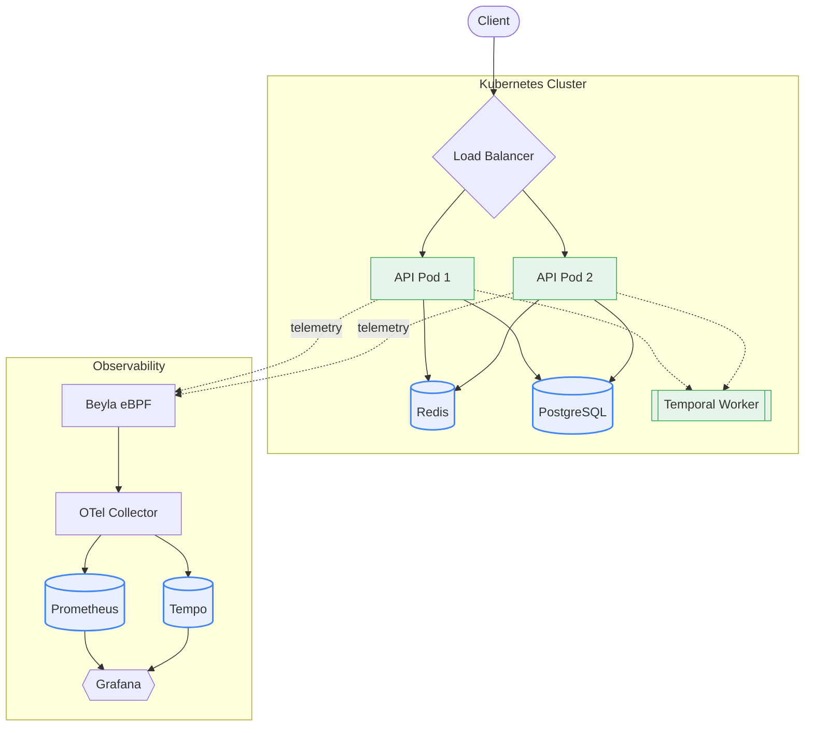
```mermaid
flowchart TD
    Client([Client]) --> LB{Load Balancer}

    subgraph K8s["Kubernetes Cluster"]
        direction TB
        LB --> API1[API Pod 1]
        LB --> API2[API Pod 2]
        API1 --> Cache[(Redis)]
        API2 --> Cache
        API1 --> DB[(PostgreSQL)]
        API2 --> DB
        API1 -.-> Temporal[[Temporal Worker]]
        API2 -.-> Temporal
    end

    subgraph Obs["Observability"]
        Beyla[Beyla eBPF] --> OTel[OTel Collector]
        OTel --> Prom[(Prometheus)]
        OTel --> Traces[(Tempo)]
        Prom --> Grafana{{Grafana}}
        Traces --> Grafana
    end

    API1 -. telemetry .-> Beyla
    API2 -. telemetry .-> Beyla

    classDef db fill:#e8f0fe,stroke:#4285f4,stroke-width:2px;
    classDef svc fill:#e6f4ea,stroke:#34a853;
    class DB,Cache,Prom,Traces db;
    class API1,API2,Temporal svc;
```

### 8.2 Sequence Diagram (loops, alt, notes, activation)

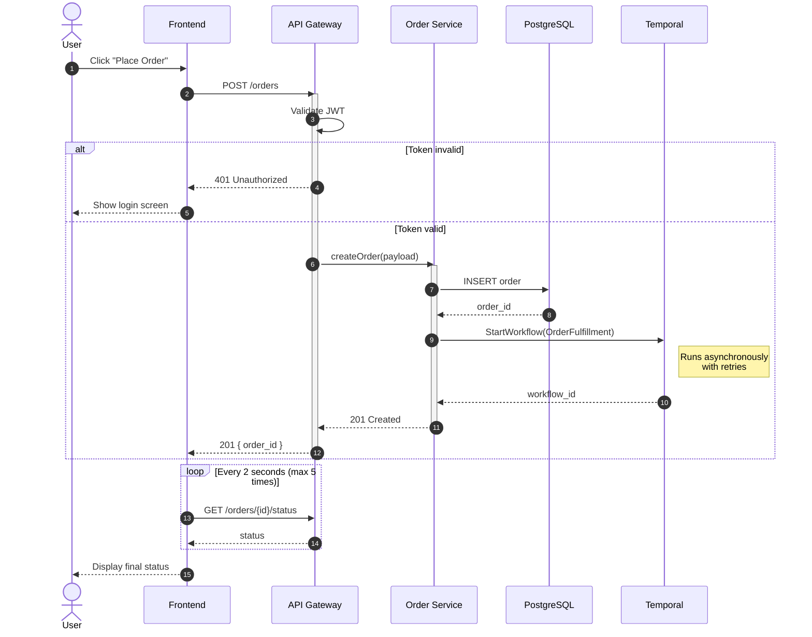
```mermaid
sequenceDiagram
    autonumber
    actor U as User
    participant FE as Frontend
    participant GW as API Gateway
    participant SVC as Order Service
    participant DB as PostgreSQL
    participant TMP as Temporal

    U->>FE: Click "Place Order"
    FE->>GW: POST /orders
    activate GW
    GW->>GW: Validate JWT
    alt Token invalid
        GW-->>FE: 401 Unauthorized
        FE-->>U: Show login screen
    else Token valid
        GW->>SVC: createOrder(payload)
        activate SVC
        SVC->>DB: INSERT order
        DB-->>SVC: order_id
        SVC->>TMP: StartWorkflow(OrderFulfillment)
        Note right of TMP: Runs asynchronously<br/>with retries
        TMP-->>SVC: workflow_id
        SVC-->>GW: 201 Created
        deactivate SVC
        GW-->>FE: 201 { order_id }
    end
    deactivate GW

    loop Every 2 seconds (max 5 times)
        FE->>GW: GET /orders/{id}/status
        GW-->>FE: status
    end
    FE-->>U: Display final status
```

### 8.3 Class Diagram

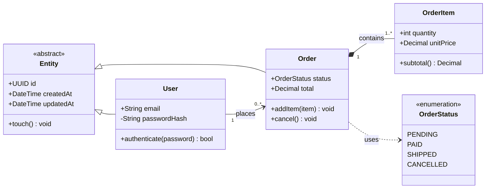
```mermaid
classDiagram
    direction LR

    class Entity {
        <<abstract>>
        +UUID id
        +DateTime createdAt
        +DateTime updatedAt
        +touch() void
    }

    class User {
        +String email
        -String passwordHash
        +authenticate(password) bool
    }

    class Order {
        +OrderStatus status
        +Decimal total
        +addItem(item) void
        +cancel() void
    }

    class OrderItem {
        +int quantity
        +Decimal unitPrice
        +subtotal() Decimal
    }

    class OrderStatus {
        <<enumeration>>
        PENDING
        PAID
        SHIPPED
        CANCELLED
    }

    Entity <|-- User
    Entity <|-- Order
    User "1" --> "0..*" Order : places
    Order "1" *-- "1..*" OrderItem : contains
    Order ..> OrderStatus : uses
```

### 8.4 State Diagram (nested states)

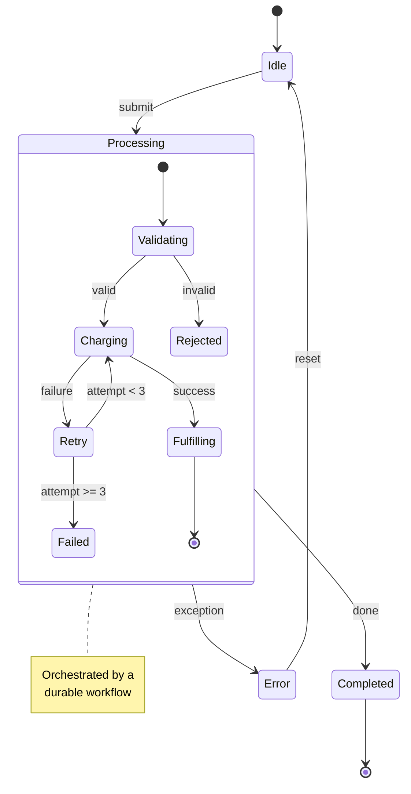
```mermaid
stateDiagram-v2
    [*] --> Idle

    Idle --> Processing : submit
    state Processing {
        [*] --> Validating
        Validating --> Charging : valid
        Validating --> Rejected : invalid
        Charging --> Fulfilling : success
        Charging --> Retry : failure
        Retry --> Charging : attempt < 3
        Retry --> Failed : attempt >= 3
        Fulfilling --> [*]
    }

    Processing --> Completed : done
    Processing --> Error : exception
    Error --> Idle : reset
    Completed --> [*]

    note right of Processing
        Orchestrated by a
        durable workflow
    end note
```

### 8.5 Entity Relationship Diagram

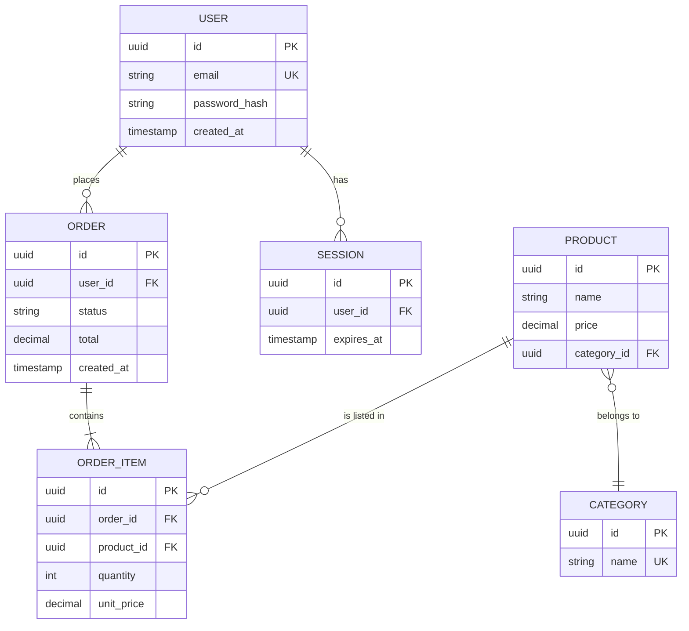
```mermaid
erDiagram
    USER ||--o{ ORDER : places
    USER ||--o{ SESSION : has
    ORDER ||--|{ ORDER_ITEM : contains
    PRODUCT ||--o{ ORDER_ITEM : "is listed in"
    PRODUCT }o--|| CATEGORY : "belongs to"

    USER {
        uuid id PK
        string email UK
        string password_hash
        timestamp created_at
    }
    ORDER {
        uuid id PK
        uuid user_id FK
        string status
        decimal total
        timestamp created_at
    }
    ORDER_ITEM {
        uuid id PK
        uuid order_id FK
        uuid product_id FK
        int quantity
        decimal unit_price
    }
    PRODUCT {
        uuid id PK
        string name
        decimal price
        uuid category_id FK
    }
    CATEGORY {
        uuid id PK
        string name UK
    }
    SESSION {
        uuid id PK
        uuid user_id FK
        timestamp expires_at
    }
```

### 8.6 Gantt Chart

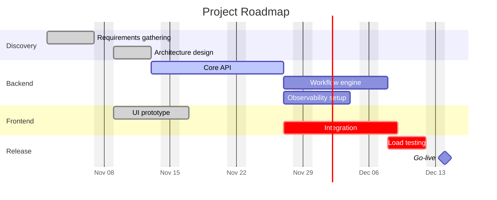
```mermaid
gantt
    title Project Roadmap
    dateFormat  YYYY-MM-DD
    axisFormat  %b %d
    excludes    weekends

    section Discovery
    Requirements gathering   :done,    req,  2026-11-02, 5d
    Architecture design      :done,    arch, after req, 4d

    section Backend
    Core API                 :active,  api,  after arch, 10d
    Workflow engine          :         wf,   after api, 7d
    Observability setup      :         obs,  after api, 5d

    section Frontend
    UI prototype             :done,    ui1,  2026-11-09, 6d
    Integration              :crit,    ui2,  after api, 8d

    section Release
    Load testing             :crit,    lt,   after wf, 4d
    Go-live                  :milestone, ms, after lt, 0d
```

### 8.7 Pie Chart

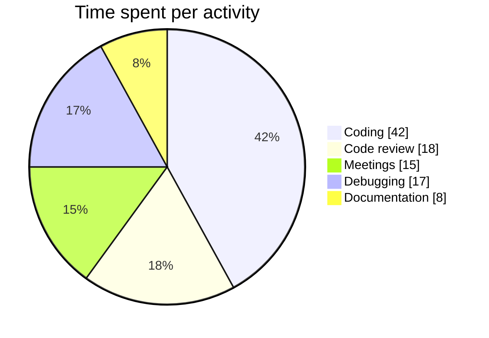
```mermaid
pie showData
    title Time spent per activity
    "Coding" : 42
    "Code review" : 18
    "Meetings" : 15
    "Debugging" : 17
    "Documentation" : 8
```

### 8.8 Mindmap

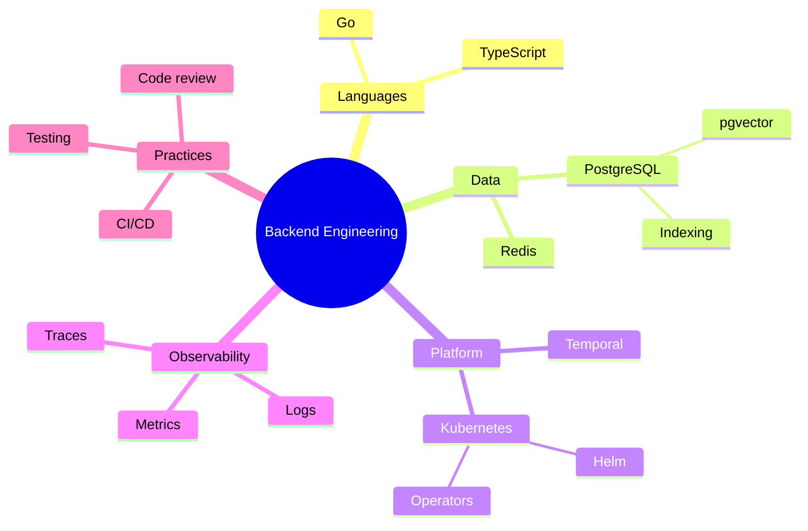
```mermaid
mindmap
  root((Backend Engineering))
    Languages
      Go
      TypeScript
    Data
      PostgreSQL
        pgvector
        Indexing
      Redis
    Platform
      Kubernetes
        Helm
        Operators
      Temporal
    Observability
      Metrics
      Traces
      Logs
    Practices
      Testing
      CI/CD
      Code review
```

### 8.9 Git Graph

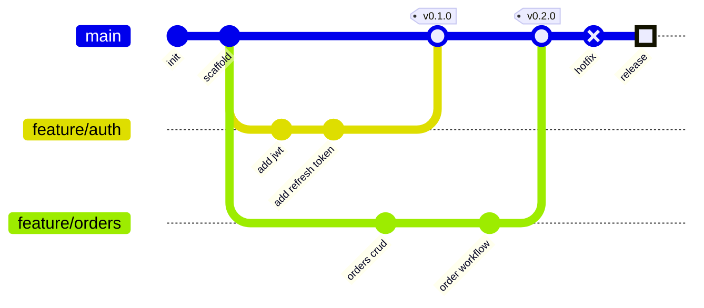
```mermaid
gitGraph
    commit id: "init"
    commit id: "scaffold"
    branch feature/auth
    checkout feature/auth
    commit id: "add jwt"
    commit id: "add refresh token"
    checkout main
    branch feature/orders
    commit id: "orders crud"
    checkout main
    merge feature/auth tag: "v0.1.0"
    checkout feature/orders
    commit id: "order workflow"
    checkout main
    merge feature/orders tag: "v0.2.0"
    commit id: "hotfix" type: REVERSE
    commit id: "release" type: HIGHLIGHT
```

### 8.10 User Journey

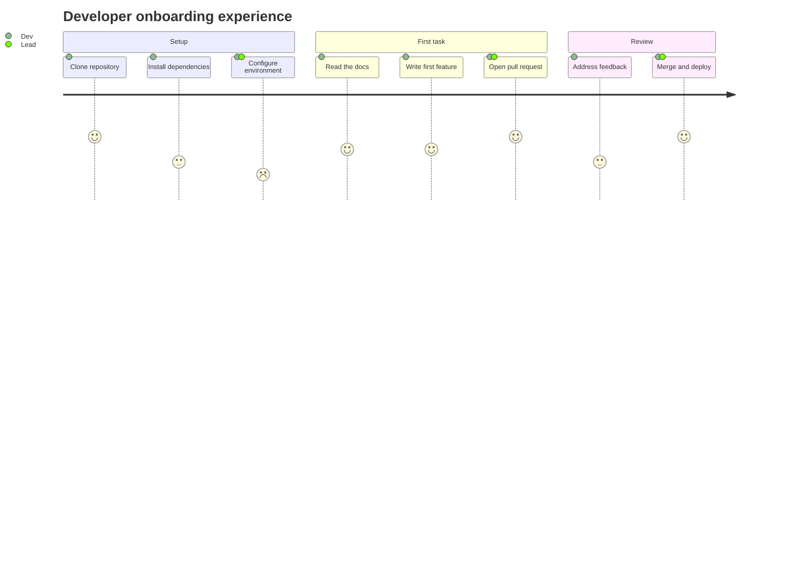
```mermaid
journey
    title Developer onboarding experience
    section Setup
      Clone repository: 5: Dev
      Install dependencies: 3: Dev
      Configure environment: 2: Dev, Lead
    section First task
      Read the docs: 4: Dev
      Write first feature: 4: Dev
      Open pull request: 5: Dev, Lead
    section Review
      Address feedback: 3: Dev
      Merge and deploy: 5: Dev, Lead
```

### 8.11 Timeline

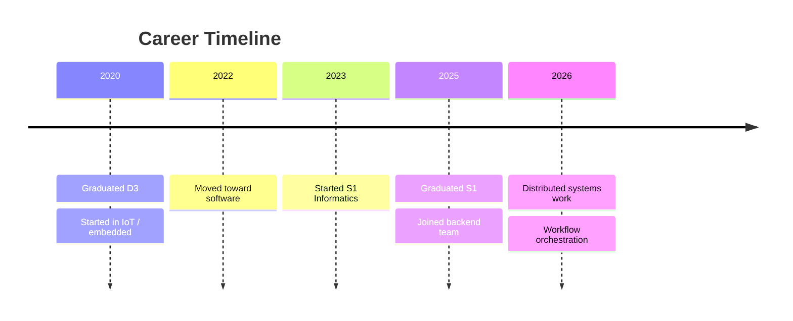
```mermaid
timeline
    title Career Timeline
    2020 : Graduated D3
         : Started in IoT / embedded
    2022 : Moved toward software
    2023 : Started S1 Informatics
    2025 : Graduated S1
         : Joined backend team
    2026 : Distributed systems work
         : Workflow orchestration
```

### 8.12 Quadrant Chart

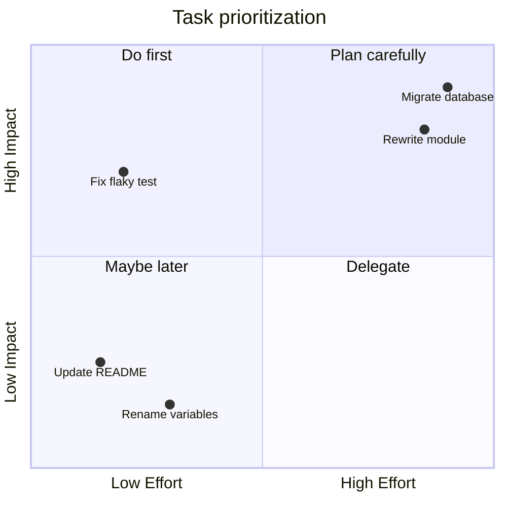
```mermaid
quadrantChart
    title Task prioritization
    x-axis Low Effort --> High Effort
    y-axis Low Impact --> High Impact
    quadrant-1 Plan carefully
    quadrant-2 Do first
    quadrant-3 Maybe later
    quadrant-4 Delegate
    Fix flaky test: [0.2, 0.7]
    Rewrite module: [0.85, 0.8]
    Update README: [0.15, 0.25]
    Migrate database: [0.9, 0.9]
    Rename variables: [0.3, 0.15]
```

### 8.13 Requirement Diagram

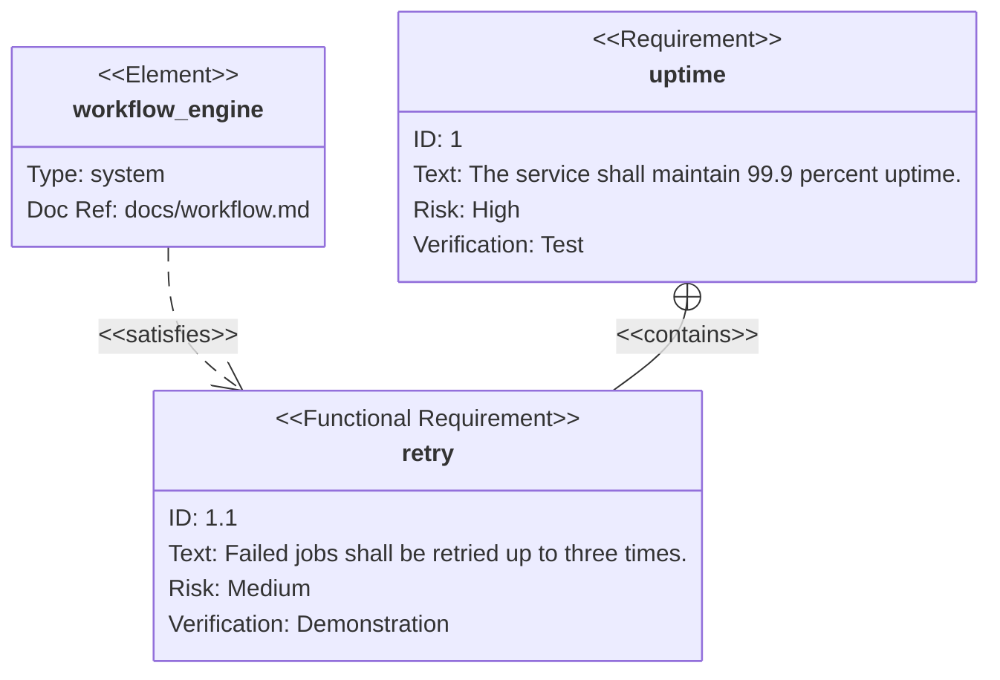
```mermaid
requirementDiagram
    requirement uptime {
        id: 1
        text: The service shall maintain 99.9 percent uptime.
        risk: high
        verifymethod: test
    }

    functionalRequirement retry {
        id: 1.1
        text: Failed jobs shall be retried up to three times.
        risk: medium
        verifymethod: demonstration
    }

    element workflow_engine {
        type: system
        docref: docs/workflow.md
    }

    workflow_engine - satisfies -> retry
    uptime - contains -> retry
```

### 8.14 C4 Context Diagram

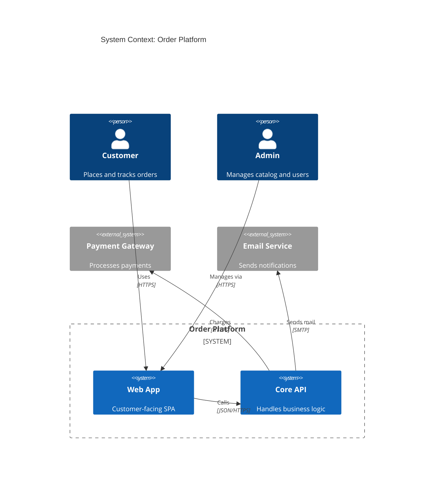
```mermaid
C4Context
    title System Context: Order Platform

    Person(customer, "Customer", "Places and tracks orders")
    Person(admin, "Admin", "Manages catalog and users")

    System_Boundary(b1, "Order Platform") {
        System(web, "Web App", "Customer-facing SPA")
        System(api, "Core API", "Handles business logic")
    }

    System_Ext(payment, "Payment Gateway", "Processes payments")
    System_Ext(email, "Email Service", "Sends notifications")

    Rel(customer, web, "Uses", "HTTPS")
    Rel(admin, web, "Manages via", "HTTPS")
    Rel(web, api, "Calls", "JSON/HTTPS")
    Rel(api, payment, "Charges", "HTTPS")
    Rel(api, email, "Sends mail", "SMTP")
```

### 8.15 Sankey Diagram

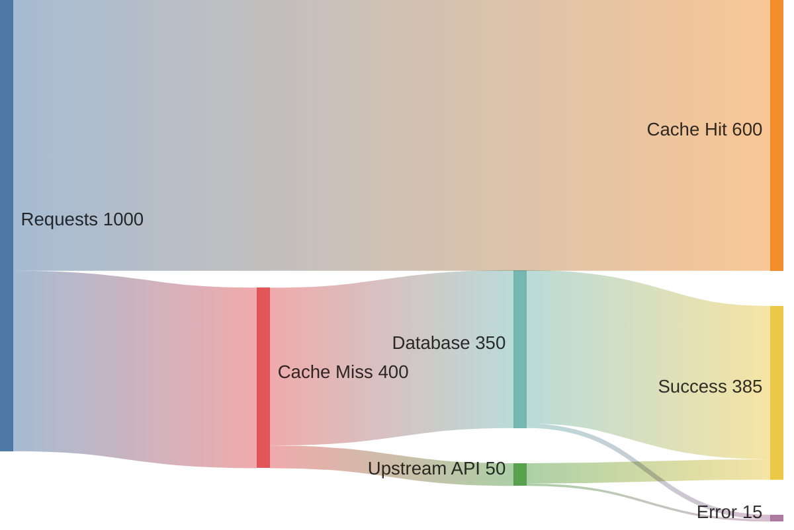
```mermaid
sankey-beta

Requests,Cache Hit,600
Requests,Cache Miss,400
Cache Miss,Database,350
Cache Miss,Upstream API,50
Database,Success,340
Database,Error,10
Upstream API,Success,45
Upstream API,Error,5
```

### 8.16 XY Chart

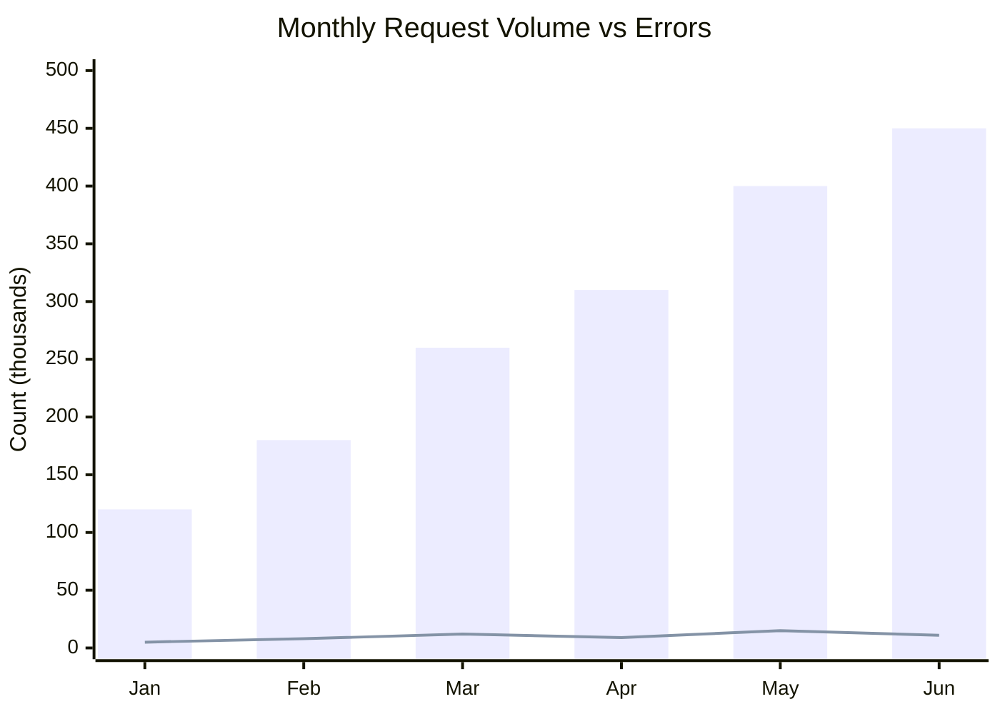
```mermaid
xychart-beta
    title "Monthly Request Volume vs Errors"
    x-axis [Jan, Feb, Mar, Apr, May, Jun]
    y-axis "Count (thousands)" 0 --> 500
    bar [120, 180, 260, 310, 400, 450]
    line [5, 8, 12, 9, 15, 11]
```

### 8.17 Block Diagram

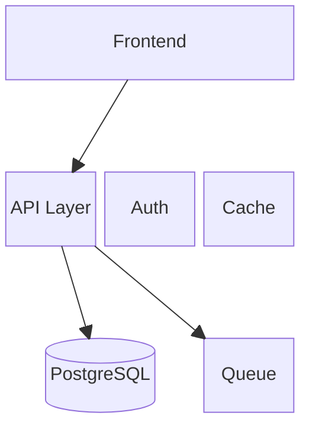
```mermaid
block-beta
    columns 3
    Frontend:3
    space:3
    API["API Layer"] Auth["Auth"] Cache["Cache"]
    space:3
    DB[("PostgreSQL")]:2 Queue["Queue"]

    Frontend --> API
    API --> DB
    API --> Queue
```

### 8.18 Architecture Diagram

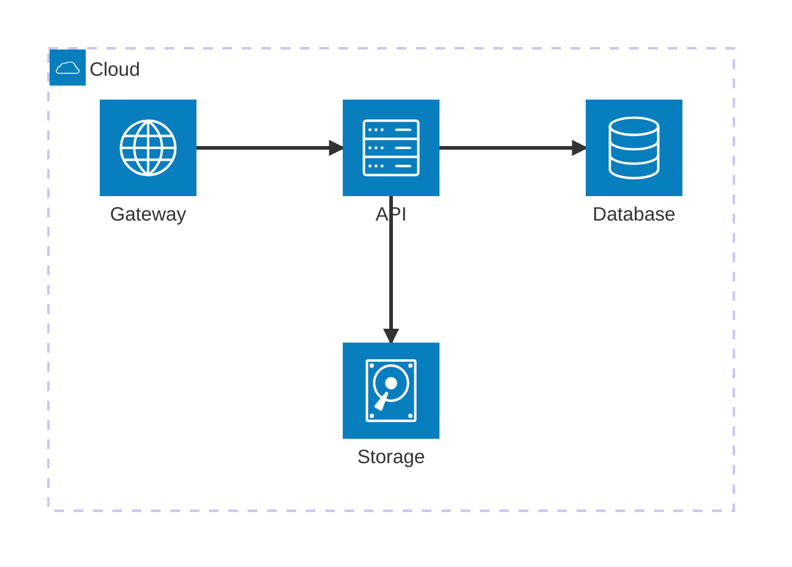
```mermaid
architecture-beta
    group cloud(cloud)[Cloud]

    service gateway(internet)[Gateway] in cloud
    service api(server)[API] in cloud
    service db(database)[Database] in cloud
    service store(disk)[Storage] in cloud

    gateway:R --> L:api
    api:R --> L:db
    api:B --> T:store
```

---

## 9. Mermaid Edge Cases

### Special characters and long labels

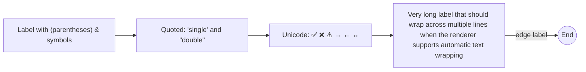
```mermaid
flowchart LR
    A["Label with (parentheses) & symbols"] --> B["Quoted: 'single' and #quot;double#quot;"]
    B --> C["Unicode: ✅ ❌ ⚠️ → ← ↔"]
    C --> D["Very long label that should wrap across multiple lines when the renderer supports automatic text wrapping"]
    D -->|"edge label"| E((End))
```

### Themed diagram via init directive

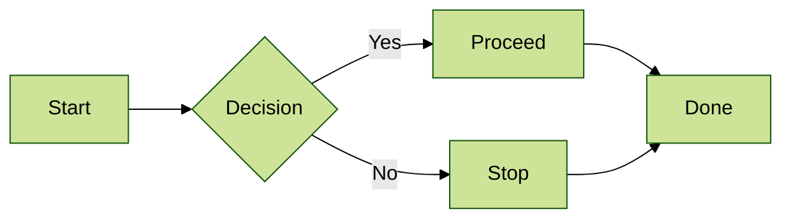
```mermaid
%%{init: {"theme": "forest", "flowchart": {"curve": "basis"}}}%%
flowchart LR
    A[Start] --> B{Decision}
    B -->|Yes| C[Proceed]
    B -->|No| D[Stop]
    C --> E[Done]
    D --> E
```

### Intentionally invalid diagram (error handling test)

```mermaid
flowchart TD
    A --> B -->
    C[[ unclosed
```

---

## 10. Horizontal Rules & Misc

***

___

Emoji shortcodes: :rocket: :tada: :warning:

Image (broken link on purpose, tests alt text): 

HTML comment (should be invisible): <!-- this should not render -->

---

*End of document.*
